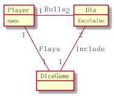
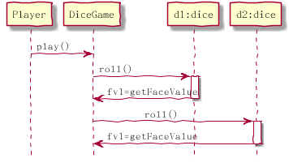

[TOC]
# UML和模式应用
## 第一部分  绪论
### 第1章 面向对象分析和设计
#### 1.1 本书的主要内容

#### 1.2 最重要的学习目标

$$
\begin{array}{||}
\hline
\text{在OO开发过各中，至关重要的能力是熟练地为软件对象分配职责}\\
\hline
\end{array}
$$

#### 1.3 什么是分析和设计
**分析(analysis)**强调的是对问题和需求的研究，而不是解决方案。
**设计(design)**强调的是满足需求的概念上的解决方案，而不是其实现。
有益的分析和设计可以概括为：** 做正确的事（分析）和正确地做事（设计）**
#### 1.4 什么是面向对象分析和设计
在**面向对象分析（object-oriented analysis)**过程中，强调的是在问题领域内发现和描述对象(或概念)。
在**面向对像设计（object-oriented design**过程中，强调的是定义软件对象以及它们如何协作以实现需求
####1.5 简单示例
1. 定义用例
骰子游戏：游戏者请求掷骰子。系统展示结果：如果骰子的总点数是7，则游戏者赢；否则游戏者输。
1. 定义领域模型

图1-3 骰子游戏的局部领域模型

1. 分配对象职责并绘制交互图

图1-4 顺序图描述软件对象之间的消息传递

1. 定义设计类图

#### 1.6 什么是UML
$$
\bf{统一建模语言（UML）是描述、构造和文档化系统制品的\color{#F00}{可视化}语言[OMG03a]。}
$$

#### 1.7 可视化建模的优点

#### 1.8 历史
#### 1.9 参考资料
### 第2章 迭代、进化和敏捷
#### 2.1 什么是UP？其它方法能否对其进行补充
#### 2.2 什么是迭代和进化式开发
#### 2.3 什么是瀑布生命周期
#### 2.4 如何进行迭代和进化式分析和设计
#### 2.5 什么是风险驱动和客户驱动的迭代计划
#### 2.6 什么是敏捷方法及其观点
#### 2.7 什么是敏捷方法及其观点
#### 2.8 什么是敏捷UP
#### 2.9 UP的其它关键实现
#### 2.10 什么是UP的阶段
#### 2.11 什么是UP的科目
#### 2.12 如何定制过程和UP的开发案例
#### 2.13 判断你是否理解迭代开发和UP
#### 2.14 历史
#### 2.15 参考资料

### 第3章 案例研究
#### 3.1 案例研究中涵盖的内容
#### 3.2 安全研究策略：迭代开发+迭代学习
#### 3.3 案例一：NextGen POS系统
#### 3.4 案例二：Monopoly游戏系统
