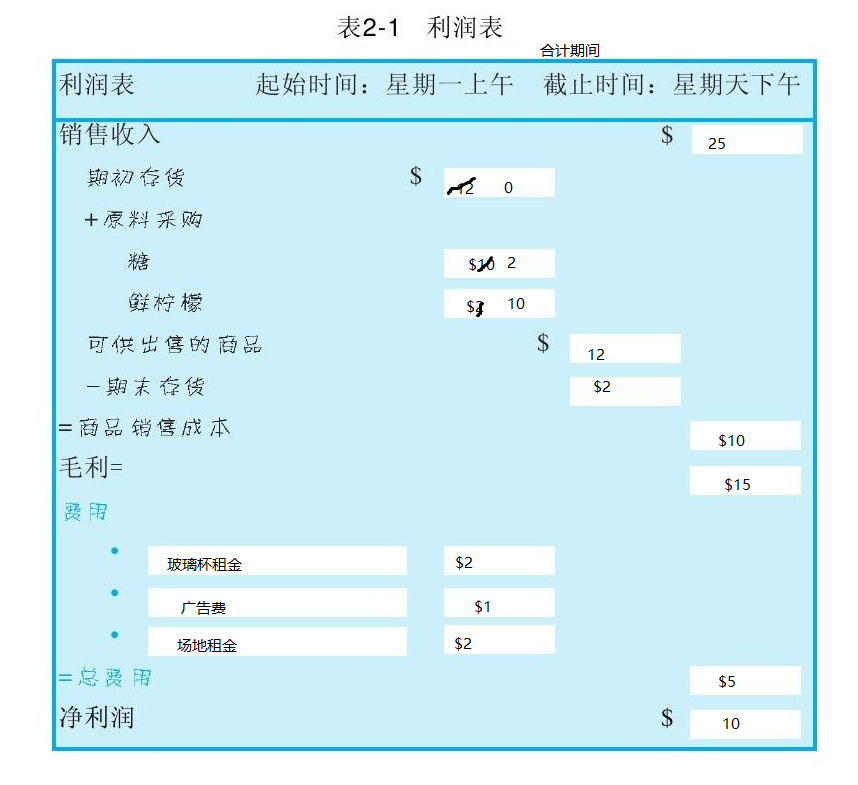
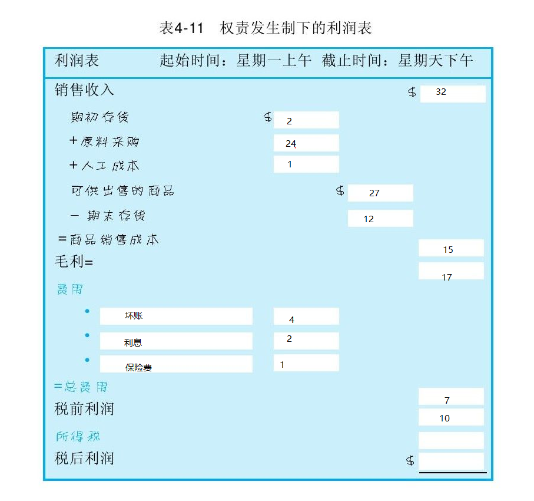
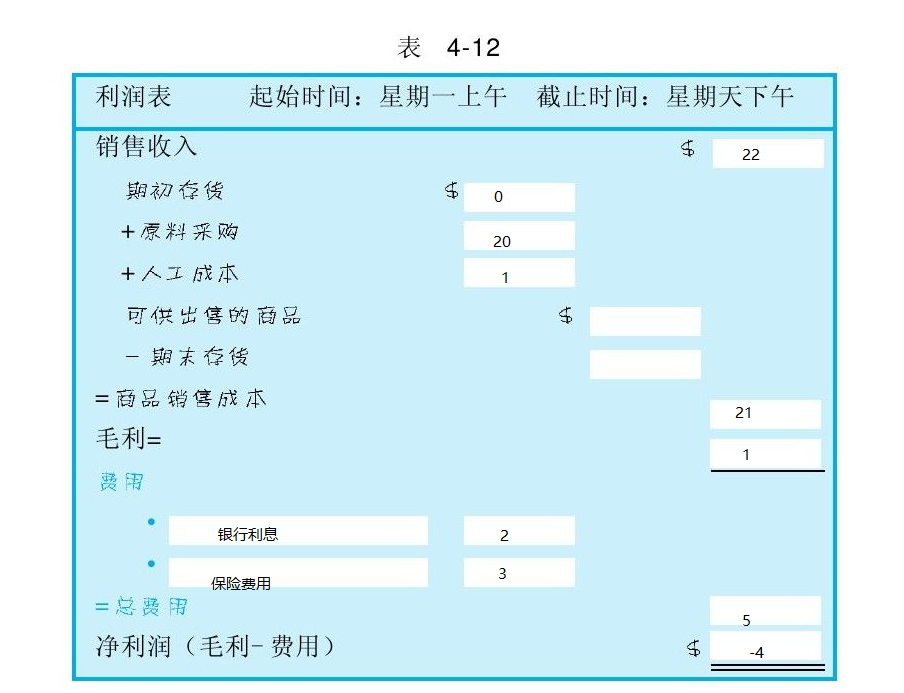

[TOC]
# 世界上最简单的会计书

## 第1章 现金、原始投资、资产、负债、应付票据、所有者权益、资产负债表、存货、盈利、费用

记账卡片：我们有什么/谁拥有它

| 我们所拥有的东西 | 所有权归谁 |
|--------|--------|
| 现金:5美元|初始投资:5美元|
| 合计 ++5美元++ |合计 ++5美元++ |

** 左边永远等于右边**

** 资产:**我们所拥有的东西

** 资产=负债+所有者权益**

** 权益、所有者权益、股东权益、净值**

** 存货(INVENTORY)**:制作产品所购买的原材料

** 毛利**:销售收入-成本

** 费用**:指那些剔除产品生产成本之外企业经营所需要的花费

** 运营报表、利润表、损益表**:利润表

## 第2章 毛利、净利润、利润表、现金流量

** 商品销售成本**

** 毛利 = 销售收入 - 销售成本 **
** 净利润(收益、纯利润、底线值) = 毛利 - 费用 **

## 第3章 留存收益、贷款、赊账、应付账款、应付票据

** 期末存货-> 期初存货**
**历史盈利**
**留存收益**:以前的盈利或是过去会计期间的累积利润

** 应付票据**:获得现金
** 应付账款**:获得商品或服务

## 第4章 应付工资、应收账款、坏账、利息、待摊费用、权责发生制、收付实现制、创意会计

** 原材料 **
** 产成品 **
** 在产品 **

产品生产的工艺是从原材料到在产品再到产成品

## 第5章 服务业

## 第6章 先进先出法、后进先出法

## 第7章 现金流量表、固定资产、资本化、折旧

## 第8章 利润VS现金

## 第9章 税金、清算

## 第10章 最后分析--增加利润